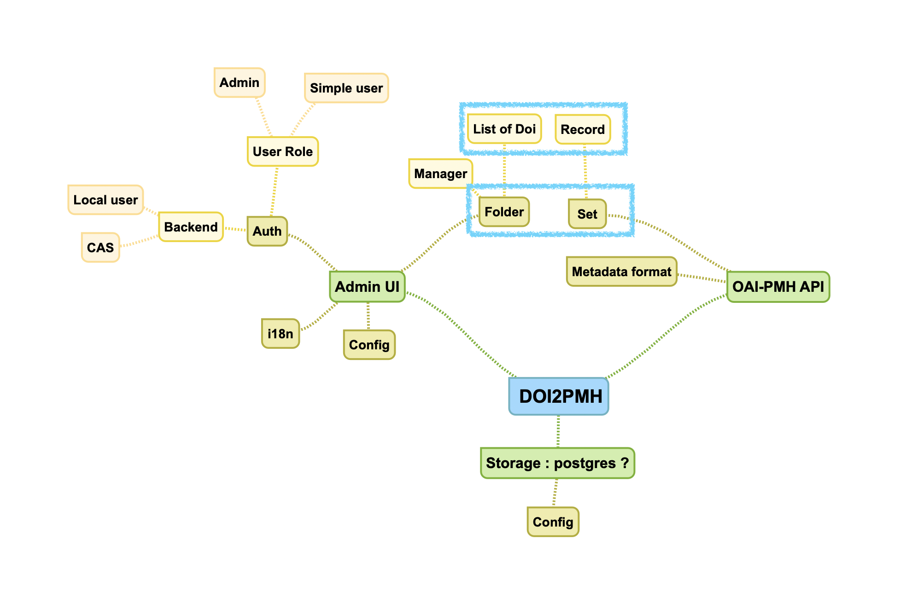

# doi2pmh-server
An OAI-PMH server that provides harvesting sets based on a list of DOIs.

It fetches on one side the metadata of publications that already have an assigned DOI and exposes it on the other side through the OAI-PMH protocol.

This is a **Dataverse community driven project**.

## Concept

## Background
Based on Feature Requests from the Dataverse Community:
- [When I create a dataset, I want use an existing DOI](https://github.com/IQSS/dataverse/issues/6425)
- [Harvesting DOI metadata from non-OAI-PMH sources](https://github.com/IQSS/dataverse/issues/5402)

## Documentation

The documentation is in the docs/ folder and starts [here](./docs/00-summary.md).
